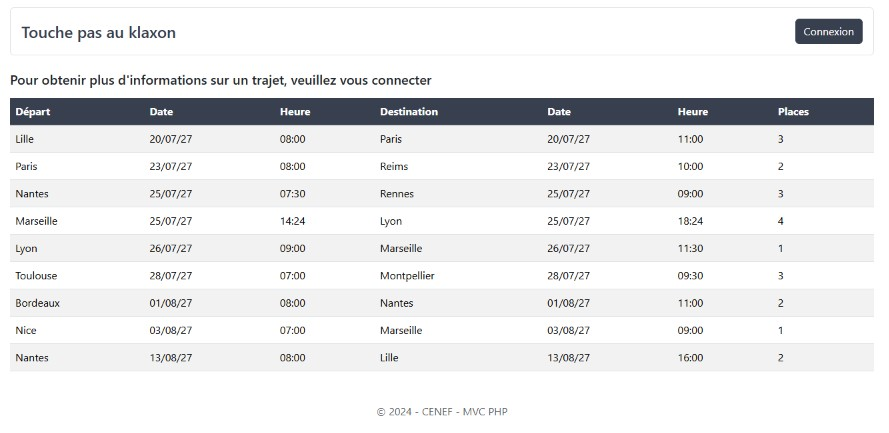
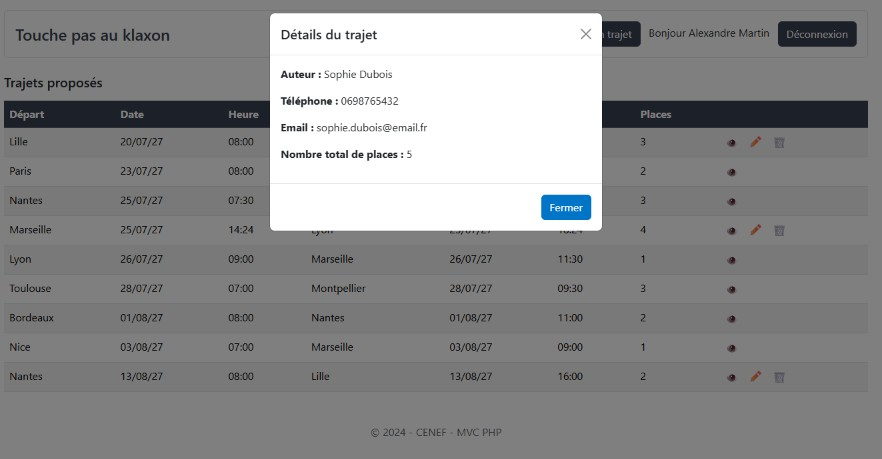
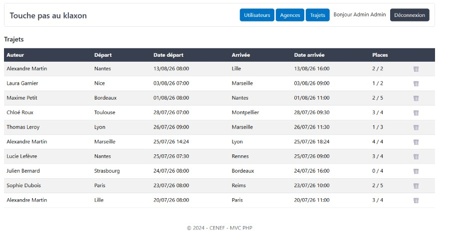

# 🚗 Touche pas au klaxon

An intranet carpooling application allowing employees of a multi-site company to share their trips between agencies.

> Fictional project built as part of the Web & Mobile Web Developer training (Centre Européen de Formation).

---

## 📖 About the project

The company operates several sites across France and generates many inter-site trips, often with only the driver on board. This intranet application lets employees publish the trips they have planned so that colleagues can join them, reducing the number of vehicles on the road.

The application is built in **PHP without a framework**, on a custom **MVC architecture**: routing, controllers, models, templates, authentication and flash messages are all implemented by hand.


<p align="center">
  
  
  
</p>

---

## ✨ Features

### For every visitor
- List of upcoming trips with available seats, sorted by departure date

### For logged-in employees
- View the details of a trip (driver, phone, email, total seats) in a modal
- Propose a new trip
- Edit or delete **their own** trips only (ownership is checked server-side)
- Form validation: departure and arrival agencies must differ, arrival must be after departure

### For administrators
- Dashboard
- List of all employees (read-only: employee data comes from the HR system)
- Full CRUD on agencies (cities)
- List of all trips, with the ability to delete any of them

---

## 🛠 Tech stack

| Layer | Technology | Why |
|---|---|---|
| Back-end | PHP 8.2 (custom MVC, no framework) | Understand how a framework works under the hood |
| Routing | [izniburak/router](https://packagist.org/packages/izniburak/router) | Lightweight router with URL parameters |
| Database | MySQL / MariaDB with PDO | Prepared statements for every query |
| Front-end | Bootstrap 5 + Sass | Responsive layout with a custom colour palette |
| Code quality | PHPStan (level 5) | Static analysis to catch type and logic errors |
| Testing | PHPUnit | Unit tests on the models, run against a dedicated test database |
| Tooling | Composer (PSR-4 autoloading) · npm (Sass compilation) | |

---

## 🧱 Architecture highlights

- **Generic base model** (`core/DefaultModel.php`): shared `findAll`, `findById`, `insert`, `update` and `delete` methods, inherited by every model
- **Security**: PDO prepared statements against SQL injection, hashed passwords (`password_verify`), output escaping with `htmlspecialchars` against XSS
- **Access control** (`core/Auth.php`): session-based authentication, with `requireLogin` and `requireAdmin` guards and an ownership check on every trip modification
- **Flash messages** (`core/Flash.php`) for user feedback after each action
- **Separate configuration** for the application and the test database, kept out of version control

---

## 🗂 Project structure

```
covoit-touche-pas-au-klaxon/
├── app/
│   ├── Controllers/      # Home, Auth, Trajet, Admin controllers
│   └── Models/           # Agence, Trajet, Utilisateur models
├── core/                 # Auth, Database, DefaultModel, Flash
├── config/               # Configuration templates (*.example.php)
├── database/             # SQL scripts (schema, test data, test database)
├── public/               # Entry point (index.php, routes) and compiled assets
├── scss/                 # Sass sources
├── template/             # Views (pages, admin, partials)
├── tests/                # PHPUnit tests
└── composer.json
```

---

## 🔐 Data model

```
UTILISATEUR (id_utilisateur, nom, prenom, telephone, email, mot_de_passe, est_admin)
AGENCE      (id_agence, nom_ville)
TRAJET      (id_trajet, date_depart, date_arrivee, nb_places_tot, nb_places_dispo,
             #id_utilisateur, #id_agence_depart, #id_agence_arrivee)
```

A trip belongs to an employee and links two agencies (departure and arrival). Foreign keys use `ON DELETE RESTRICT`, so an agency cannot be deleted while trips still reference it.

---

## 🚀 Getting started locally

### Prerequisites
- XAMPP (or WAMP / Laragon) with PHP 8.2+ and MySQL / MariaDB
- Composer
- Node.js & npm (for Sass compilation)

### 1. Clone and install

Clone the repository into your server's document root (e.g. `htdocs/` for XAMPP):

```bash
git clone https://github.com/Marine-Briet/covoit-touche-pas-au-klaxon.git
cd covoit-touche-pas-au-klaxon

composer install
npm install
npm run build:css
```

Use `npm run watch:css` during development to recompile the stylesheet automatically.

### 2. Create the database

```bash
mysql -u root -p < database/01_creation.sql
mysql -u root -p < database/02_population.sql
```

### 3. Configuration

Copy `config/config.example.php` to `config/config.php` and fill in your own database credentials. This file is not versioned (see `.gitignore`).

### 4. Open the application

http://localhost/covoit-touche-pas-au-klaxon/public/

### Test accounts

| Role | Email | Password |
|---|---|---|
| Admin | `admin@email.fr` | `password123` |
| Employee | `alexandre.martin@email.fr` (or any of the 20 seeded employees) | `password123` |

---

## 🧪 Tests & code quality

### PHPStan (static analysis)

```bash
vendor/bin/phpstan analyse
```

Configured at level 5 (see `phpstan.neon`).

### PHPUnit (unit tests)

The tests run against a dedicated database, so that real data is never modified:

1. Create the test database:
   ```bash
   mysql -u root -p < database/01_creation_test.sql
   ```
2. Copy `config/config.test.example.php` to `config/config.test.php` and fill in your credentials.
3. Run the tests:
   ```bash
   vendor/bin/phpunit
   ```

**Coverage:** create, update and delete operations are tested for `AgenceModel` and `TrajetModel`. `UtilisateurModel` has no write tests, as the application does not expose any create/edit/delete functionality for users — employee data is read-only, sourced from the company's HR system (per project brief).

---

## 🔭 Future improvements

- Seat booking: let an employee reserve a seat, automatically decreasing the available seats
- CSRF protection on forms
- Search and filters on trips (by agency, by date)
- Online deployment

---

## 👤 Author

Marine BRIET
Built as part of the Web & Mobile Web Developer training — Centre Européen de Formation.